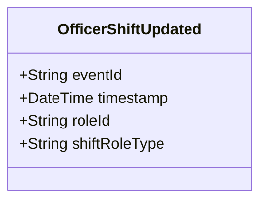

# OfficerShiftUpdated

## Description

This event is raised when an existing OfficerShift's information is updated.

## UML Class Diagram

## Domain Model Effect

- **Modifies**: The existing `OfficerShift` role entity identified by `roleId`
- **Updated Attributes**: The `shiftRoleType` attribute is updated on the OfficerShift entity
- **Note**: The `roleId` cannot be changed as it serves as the entity identifier
- **Note**: The relationships to PoliceOfficer and Shift cannot be changed through this event
- **Note**: The `checkInTime` and `checkOutTime` should not be changed through this event

