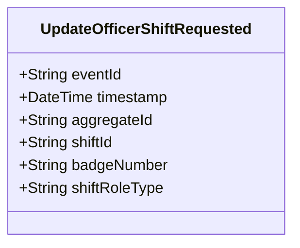

# UpdateOfficerShiftRequested

## Description

This event represents a request to update an officer shift's information. It is published to Kafka when an officer shift update is requested via the REST API. This is a request/command event, not a state change event.

## UML Class Diagram

## Domain Model Effect

This event represents a **request** to update an existing `OfficerShift` relationship. The actual update and state management happens in downstream services that consume this event.

- **Request Type**: Update request for an officer shift
- **Aggregate Identifier**: The `shiftId` is used as `aggregateId`
- **Requested Attributes**: The `shiftRoleType` is included in the update request
- **Entity Identifiers**: Both `shiftId` and `badgeNumber` identify the specific officer shift to update
- **Enum Values**: The `shiftRoleType` is provided as a string enum name (e.g., Regular, Supervisor, Trainee)
- **Relationship**: The event represents a request to update the OfficerShift relationship between the PoliceOfficer and Shift entities
