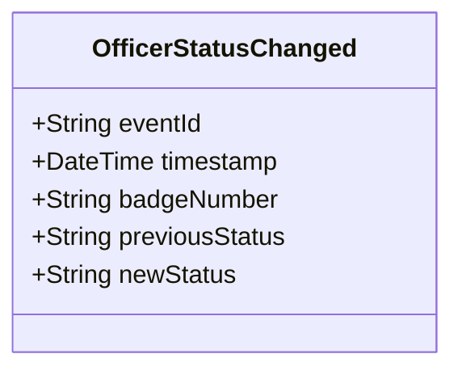

# OfficerStatusChanged

## Description

This event is raised when a police officer's status changes (e.g., Active, On-Duty, Off-Duty, Suspended, Retired).

## UML Class Diagram

## Domain Model Effect

- **Modifies**: The existing `PoliceOfficer` entity identified by `badgeNumber`
- **Status Update**: The `status` attribute of the PoliceOfficer is updated from `previousStatus` to `newStatus`
- **State Transition**: The event documents the state transition for audit purposes
- **Valid Status Values**: Active, On-Duty, Off-Duty, Suspended, Retired

