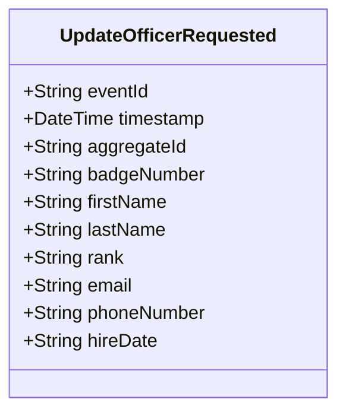

# UpdateOfficerRequested

## Description

This event represents a request to update an existing police officer's information. It is published to Kafka when an officer update is requested via the REST API. This is a request/command event, not a state change event. All fields are nullable to support partial updates - null fields mean "don't update this field".

## UML Class Diagram

## Domain Model Effect

This event represents a **request** to update an existing `PoliceOfficer` entity. The actual update and state management happens in downstream services that consume this event.

- **Request Type**: Update request for an existing police officer
- **Entity Identifier**: The `badgeNumber` identifies the officer to update (also used as `aggregateId`)
- **Partial Updates**: All fields are nullable - only non-null fields will be updated
- **Updated Attributes**: Any provided attributes (firstName, lastName, rank, email, phoneNumber, hireDate) are included in the update request
- **Note**: The `badgeNumber` cannot be changed as it serves as the entity identifier
- **Note**: Status changes should use the `ChangeOfficerStatusRequested` event instead
- **Date Format**: The `hireDate` is provided as a string in ISO-8601 format (yyyy-MM-dd) if provided
