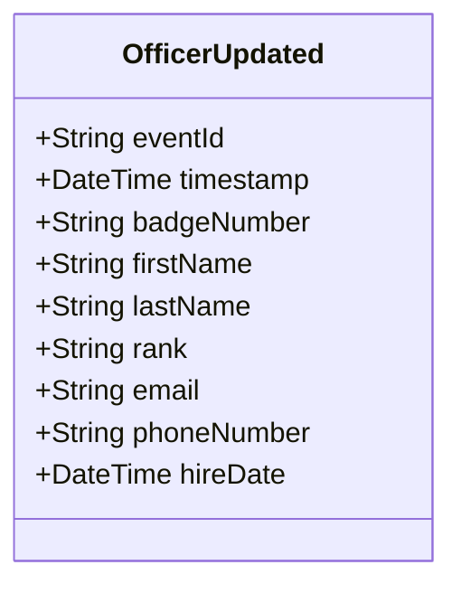

# OfficerUpdated

## Description

This event is raised when an existing police officer's information is updated (excluding status changes, which use OfficerStatusChanged).

## UML Class Diagram

## Domain Model Effect

- **Modifies**: The existing `PoliceOfficer` entity identified by `badgeNumber`
- **Updated Attributes**: All provided attributes (firstName, lastName, rank, email, phoneNumber, hireDate) are updated on the PoliceOfficer entity
- **Note**: The `badgeNumber` cannot be changed as it serves as the entity identifier
- **Note**: Status changes should use the `OfficerStatusChanged` event instead

