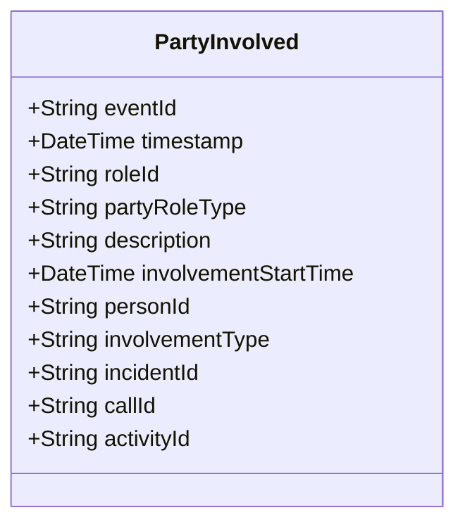

# PartyInvolved

## Description

This event is raised when a person becomes involved in an Incident, CallForService, or Activity through an InvolvedParty role.

## UML Class Diagram

## Domain Model Effect

- **Creates**: A new `InvolvedParty` role entity with the provided attributes
- **Entity Identifier**: The `roleId` serves as the unique identifier
- **Attributes**: All provided attributes (roleId, partyRoleType, description, involvementStartTime) are set on the new InvolvedParty entity
- **Relationships**: 
  - The InvolvedParty is linked to the Person identified by `personId`
  - The InvolvedParty is linked to exactly one of the following based on `involvementType`:
    - If `involvementType` is "Incident", linked to Incident identified by `incidentId`
    - If `involvementType` is "CallForService", linked to CallForService identified by `callId`
    - If `involvementType` is "Activity", linked to Activity identified by `activityId`
- **Timestamps**: The `involvementStartTime` is set to the provided value (typically the event timestamp)
- **Role Type**: The `partyRoleType` indicates how the person is involved (e.g., Victim, Suspect, Witness, Complainant)

