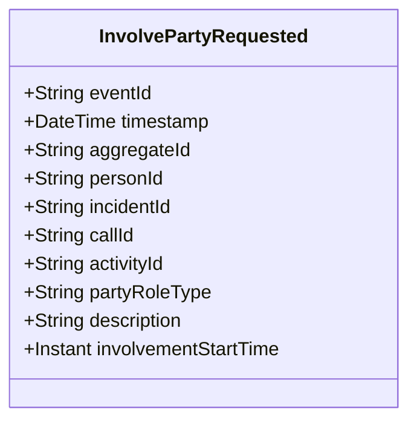

# InvolvePartyRequested

## Description

This event represents a request to involve a party in an incident, call, or activity. It is published to Kafka when a party involvement is requested via the REST API. This is a request/command event, not a state change event.

## UML Class Diagram

## Domain Model Effect

This event represents a **request** to involve a party in an incident, call, or activity. The actual involvement creation and state management happens in downstream services that consume this event.

- **Request Type**: Involvement request for a party
- **Aggregate Identifier**: The `personId` is used as `aggregateId`
- **Requested Attributes**: All provided attributes (personId, partyRoleType, description, involvementStartTime) are included in the request
- **Relationships**: Exactly one of `incidentId`, `callId`, or `activityId` must be provided to specify which entity the party is involved in
- **Role Type**: The `partyRoleType` indicates the role the party plays (e.g., Victim, Suspect, Witness, Complainant) and is provided as a string enum name
- **Timestamps**: The `involvementStartTime` is provided as an Instant
- **Relationship**: The event represents a request to create an InvolvedParty relationship between a Person and an Incident, CallForService, or Activity
