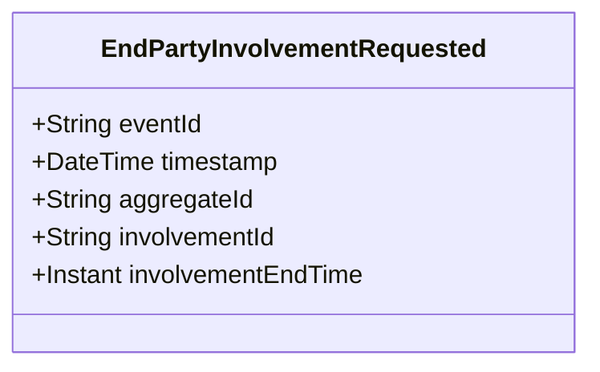

# EndPartyInvolvementRequested

## Description

This event represents a request to end a party's involvement in an incident, call, or activity. It is published to Kafka when a party involvement end is requested via the REST API. This is a request/command event, not a state change event.

## UML Class Diagram

## Domain Model Effect

This event represents a **request** to end a party's involvement. The actual involvement end processing and state management happens in downstream services that consume this event.

- **Request Type**: End involvement request for a party
- **Aggregate Identifier**: The `involvementId` is used as `aggregateId`
- **Requested Attributes**: The `involvementEndTime` is included in the request
- **Timestamps**: The `involvementEndTime` is provided as an Instant
- **Relationship**: The event represents a request to update or end the InvolvedParty relationship
