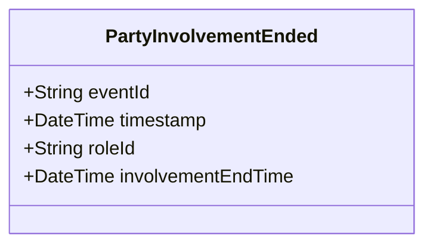

# PartyInvolvementEnded

## Description

This event is raised when a person's involvement in an Incident, CallForService, or Activity ends.

## UML Class Diagram

## Domain Model Effect

- **Modifies**: The existing `InvolvedParty` role entity identified by `roleId`
- **Timestamp Update**: The `involvementEndTime` attribute of the InvolvedParty is set to the provided `involvementEndTime` (typically the event timestamp)
- **Note**: The InvolvedParty entity may be marked as inactive, but the historical relationship is preserved

