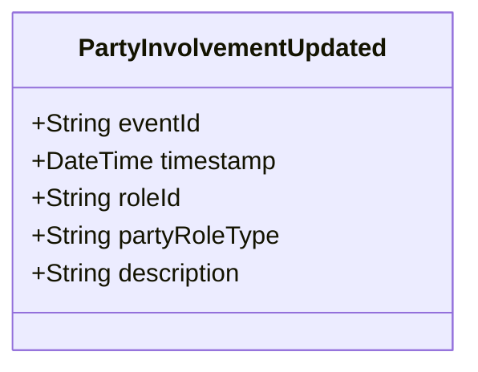

# PartyInvolvementUpdated

## Description

This event is raised when an existing InvolvedParty's information is updated.

## UML Class Diagram

## Domain Model Effect

- **Modifies**: The existing `InvolvedParty` role entity identified by `roleId`
- **Updated Attributes**: All provided attributes (partyRoleType, description) are updated on the InvolvedParty entity
- **Note**: The `roleId` cannot be changed as it serves as the entity identifier
- **Note**: The relationships to Person, Incident, CallForService, or Activity cannot be changed through this event

