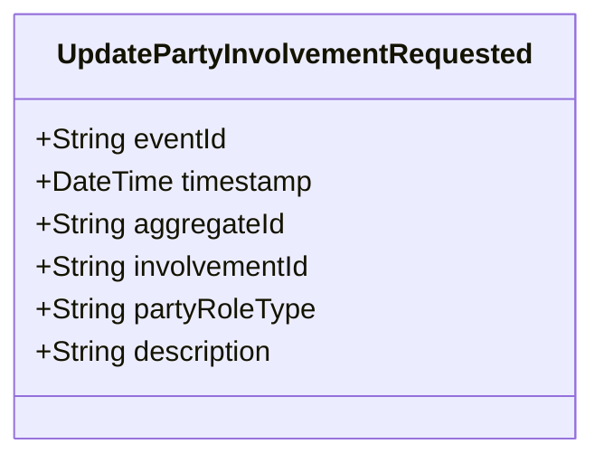

# UpdatePartyInvolvementRequested

## Description

This event represents a request to update a party involvement's information. It is published to Kafka when a party involvement update is requested via the REST API. This is a request/command event, not a state change event. All fields are nullable to support partial updates - null fields mean "don't update this field".

## UML Class Diagram

## Domain Model Effect

This event represents a **request** to update an existing `InvolvedParty` relationship. The actual update and state management happens in downstream services that consume this event.

- **Request Type**: Update request for a party involvement
- **Aggregate Identifier**: The `involvementId` is used as `aggregateId`
- **Partial Updates**: All fields are nullable - only non-null fields will be updated
- **Updated Attributes**: Any provided attributes (partyRoleType, description) are included in the update request
- **Note**: The `involvementId` cannot be changed as it serves as the entity identifier
- **Enum Values**: The `partyRoleType` is provided as a string enum name if provided
- **Relationship**: The event represents a request to update the InvolvedParty relationship
