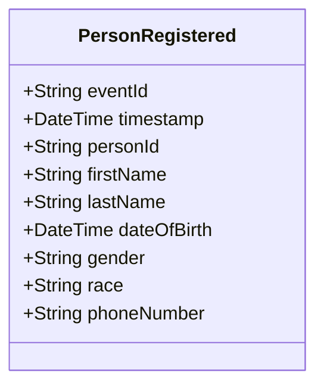

# PersonRegistered

## Description

This event is raised when a new person is registered in the system.

## UML Class Diagram

## Domain Model Effect

- **Creates**: A new `Person` entity with the provided attributes
- **Entity Identifier**: The `personId` serves as the unique identifier
- **Attributes**: All provided attributes (personId, firstName, lastName, dateOfBirth, gender, race, phoneNumber) are set on the new Person entity

