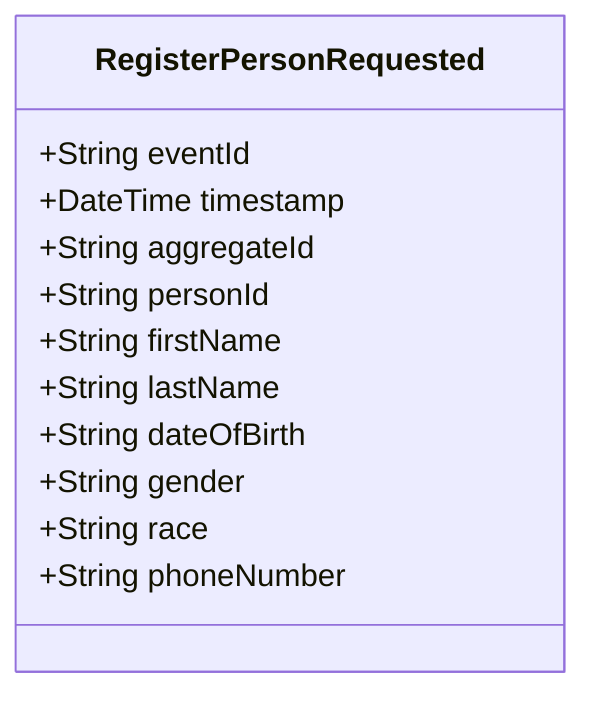

# RegisterPersonRequested

## Description

This event represents a request to register a new person. It is published to Kafka when a person registration is requested via the REST API. This is a request/command event, not a state change event.

## UML Class Diagram

## Domain Model Effect

This event represents a **request** to create a new `Person` entity. The actual creation and state management happens in downstream services that consume this event.

- **Request Type**: Registration request for a new person
- **Entity Identifier**: The `personId` serves as the unique identifier (also used as `aggregateId`)
- **Requested Attributes**: All provided attributes (firstName, lastName, dateOfBirth, gender, race, phoneNumber) are included in the request
- **Date Format**: The `dateOfBirth` is provided as a string in ISO-8601 format (yyyy-MM-dd)
- **Enum Values**: The `gender` and `race` are provided as string enum names
