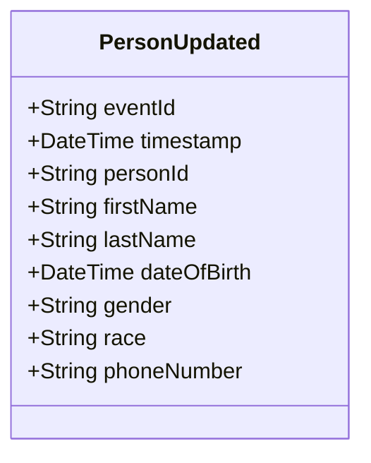

# PersonUpdated

## Description

This event is raised when an existing person's information is updated.

## UML Class Diagram

## Domain Model Effect

- **Modifies**: The existing `Person` entity identified by `personId`
- **Updated Attributes**: All provided attributes (firstName, lastName, dateOfBirth, gender, race, phoneNumber) are updated on the Person entity
- **Note**: The `personId` cannot be changed as it serves as the entity identifier

