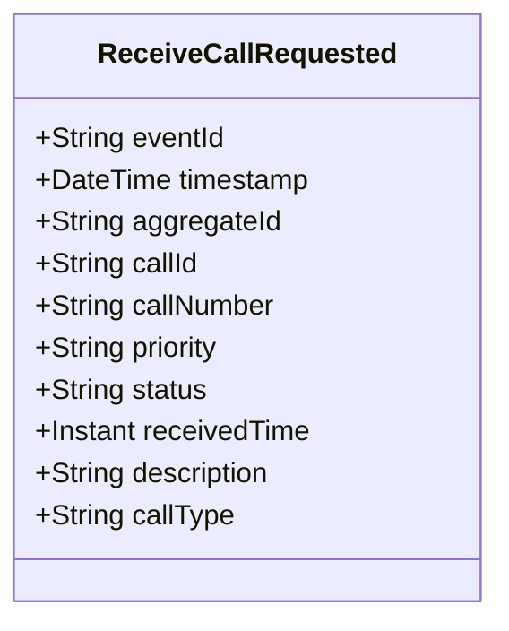

# ReceiveCallRequested

## Description

This event represents a request to receive a new call for service. It is published to Kafka when a call is received via the REST API. This is a request/command event, not a state change event.

## UML Class Diagram

## Domain Model Effect

This event represents a **request** to create a new `CallForService` entity. The actual creation and state management happens in downstream services that consume this event.

- **Request Type**: Receive request for a new call for service
- **Entity Identifier**: The `callId` serves as the unique identifier (also used as `aggregateId`)
- **Requested Attributes**: All provided attributes (callNumber, priority, status, receivedTime, description, callType) are included in the request
- **Status**: The `status` attribute is provided in the request (typically "Received")
- **Timestamps**: The `receivedTime` is provided as an Instant
- **Enum Values**: The `priority` and `callType` are provided as string enum names
