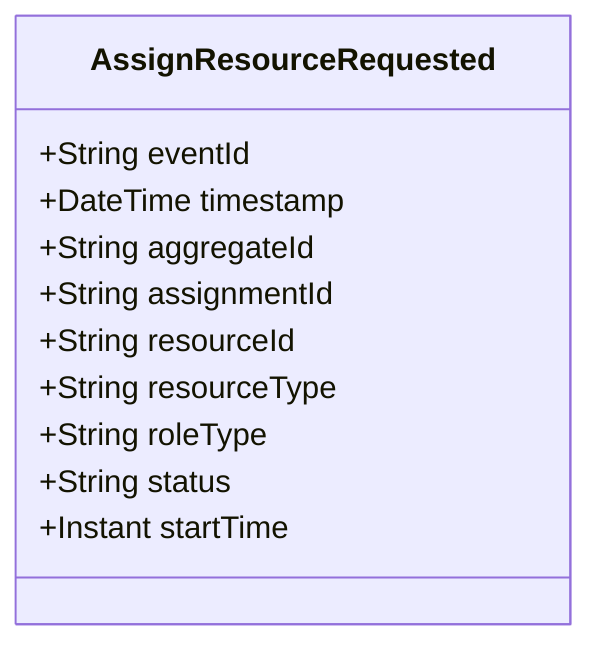

# AssignResourceRequested

## Description

This event represents a request to assign a resource to an assignment. It is published to Kafka when a resource assignment is requested via the REST API. This is a request/command event, not a state change event.

## UML Class Diagram

## Domain Model Effect

This event represents a **request** to assign a resource to an assignment. The actual resource assignment creation and state management happens in downstream services that consume this event.

- **Request Type**: Assignment request for a resource to an assignment
- **Aggregate Identifier**: The `assignmentId` is used as `aggregateId`
- **Requested Attributes**: All provided attributes (resourceId, resourceType, roleType, status, startTime) are included in the request
- **Resource Types**: The `resourceType` indicates the type of resource (Officer, Vehicle, or Unit) and is provided as a string enum name
- **Role Type**: The `roleType` indicates the role the resource plays (e.g., Primary, Backup, Supervisor) and is provided as a string enum name
- **Timestamps**: The `startTime` is provided as an Instant
- **Relationship**: The event represents a request to create a ResourceAssignment relationship between a resource and an assignment
