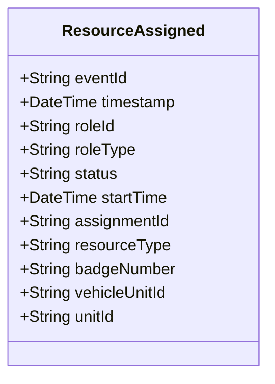

# ResourceAssigned

## Description

This event is raised when a resource (PoliceOfficer, PoliceVehicle, or Unit) is assigned to an Assignment through a ResourceAssignment role.

## UML Class Diagram

## Domain Model Effect

- **Creates**: A new `ResourceAssignment` role entity with the provided attributes
- **Entity Identifier**: The `roleId` serves as the unique identifier
- **Initial Status**: The `status` attribute is set to the provided value (typically "Active")
- **Attributes**: All provided attributes (roleId, roleType, status, startTime) are set on the new ResourceAssignment entity
- **Relationships**: 
  - The ResourceAssignment is linked to the Assignment identified by `assignmentId`
  - The ResourceAssignment is linked to exactly one resource based on `resourceType`:
    - If `resourceType` is "PoliceOfficer", linked to PoliceOfficer identified by `badgeNumber`
    - If `resourceType` is "PoliceVehicle", linked to PoliceVehicle identified by `vehicleUnitId`
    - If `resourceType` is "Unit", linked to Unit identified by `unitId`
- **Timestamps**: The `startTime` is set to the provided value (typically the event timestamp)

