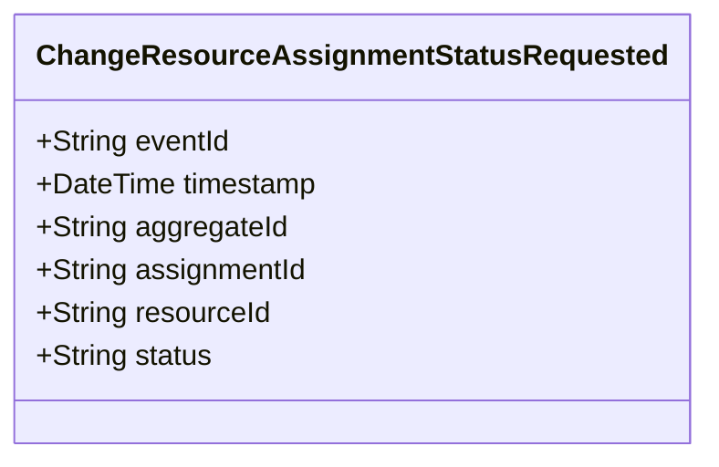

# ChangeResourceAssignmentStatusRequested

## Description

This event represents a request to change a resource assignment's status. It is published to Kafka when a resource assignment status change is requested via the REST API. This is a request/command event, not a state change event.

## UML Class Diagram

## Domain Model Effect

This event represents a **request** to change the status of an existing `ResourceAssignment` relationship. The actual status change and state management happens in downstream services that consume this event.

- **Request Type**: Status change request for an existing resource assignment
- **Aggregate Identifier**: The `assignmentId` is used as `aggregateId`
- **Entity Identifiers**: Both `assignmentId` and `resourceId` identify the specific resource assignment to update
- **Status Update**: The `status` attribute contains the requested new status value
- **State Transition**: The event represents a request for a state transition, which will be processed by downstream services
