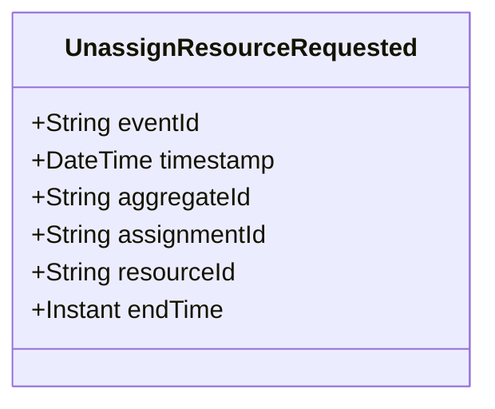

# UnassignResourceRequested

## Description

This event represents a request to unassign a resource from an assignment. It is published to Kafka when a resource unassignment is requested via the REST API. This is a request/command event, not a state change event.

## UML Class Diagram

## Domain Model Effect

This event represents a **request** to unassign a resource from an assignment. The actual resource unassignment processing and state management happens in downstream services that consume this event.

- **Request Type**: Unassignment request for a resource from an assignment
- **Aggregate Identifier**: The `assignmentId` is used as `aggregateId`
- **Requested Attributes**: Both `resourceId` and `endTime` are included in the request
- **Timestamps**: The `endTime` is provided as an Instant
- **Relationship**: The event represents a request to update or end the ResourceAssignment relationship between a resource and an assignment
