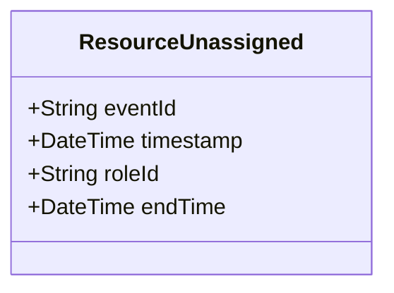

# ResourceUnassigned

## Description

This event is raised when a resource is unassigned from an Assignment, ending the ResourceAssignment role.

## UML Class Diagram

## Domain Model Effect

- **Modifies**: The existing `ResourceAssignment` role entity identified by `roleId`
- **Timestamp Update**: The `endTime` attribute of the ResourceAssignment is set to the provided `endTime` (typically the event timestamp)
- **Status Transition**: The ResourceAssignment status typically transitions to "Completed" or "Ended"
- **Note**: The ResourceAssignment entity may be marked as inactive or archived, but the historical relationship is preserved

