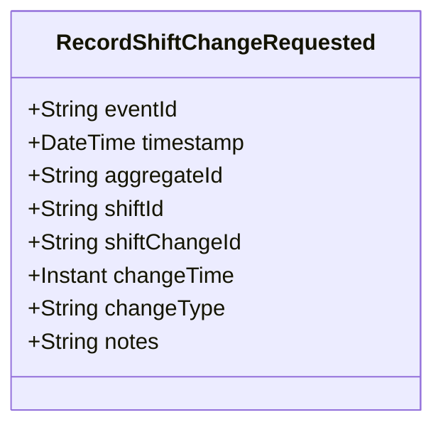

# RecordShiftChangeRequested

## Description

This event represents a request to record a shift change. It is published to Kafka when a shift change is recorded via the REST API. This is a request/command event, not a state change event.

## UML Class Diagram

## Domain Model Effect

This event represents a **request** to record a shift change. The actual shift change creation and state management happens in downstream services that consume this event.

- **Request Type**: Record request for a shift change
- **Aggregate Identifier**: The `shiftId` is used as `aggregateId`
- **Requested Attributes**: All provided attributes (shiftChangeId, changeTime, changeType, notes) are included in the request
- **Timestamps**: The `changeTime` is provided as an Instant
- **Enum Values**: The `changeType` is provided as a string enum name
- **Relationship**: The event represents a request to create a shift change record associated with the specified shift
