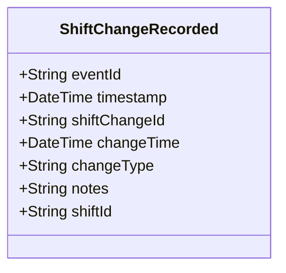

# ShiftChangeRecorded

## Description

This event is raised when a shift change is recorded, documenting the transition between shifts.

## UML Class Diagram

## Domain Model Effect

- **Creates**: A new `ShiftChange` entity with the provided attributes
- **Entity Identifier**: The `shiftChangeId` serves as the unique identifier
- **Attributes**: All provided attributes (shiftChangeId, changeTime, changeType, notes) are set on the new ShiftChange entity
- **Relationships**: The ShiftChange is linked to the Shift identified by `shiftId`
- **Timestamps**: The `changeTime` is set to the provided value (typically the event timestamp)

