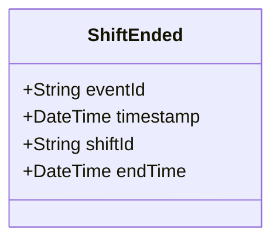

# ShiftEnded

## Description

This event is raised when a shift ends.

## UML Class Diagram

## Domain Model Effect

- **Modifies**: The existing `Shift` entity identified by `shiftId`
- **Timestamp Update**: The `endTime` attribute of the Shift is set to the provided `endTime` (typically the event timestamp)
- **Status Transition**: The shift status typically transitions to "Completed" or "Ended"

