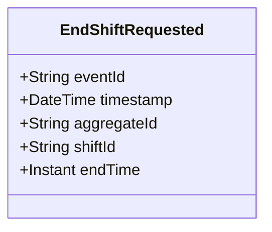

# EndShiftRequested

## Description

This event represents a request to end a shift. It is published to Kafka when a shift end is requested via the REST API. This is a request/command event, not a state change event.

## UML Class Diagram

## Domain Model Effect

This event represents a **request** to end a shift. The actual end processing and state management happens in downstream services that consume this event.

- **Request Type**: End request for a shift
- **Entity Identifier**: The `shiftId` identifies the shift to end (also used as `aggregateId`)
- **Requested Attributes**: The `endTime` is included in the request
- **Timestamps**: The `endTime` is provided as an Instant
- **State Transition**: The event represents a request to transition the shift to an ended state
