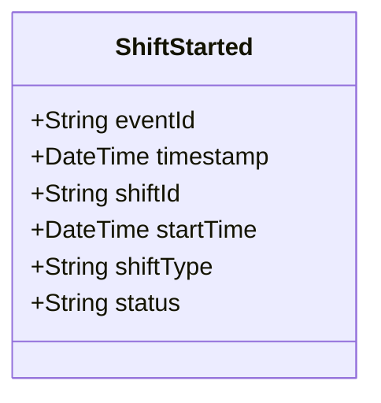

# ShiftStarted

## Description

This event is raised when a shift starts.

## UML Class Diagram

## Domain Model Effect

- **Creates**: A new `Shift` entity with the provided attributes
- **Entity Identifier**: The `shiftId` serves as the unique identifier
- **Initial Status**: The `status` attribute is set to the provided value (typically "Active")
- **Attributes**: All provided attributes (shiftId, startTime, shiftType, status) are set on the new Shift entity
- **Timestamps**: The `startTime` is set to the provided value (typically the event timestamp)

