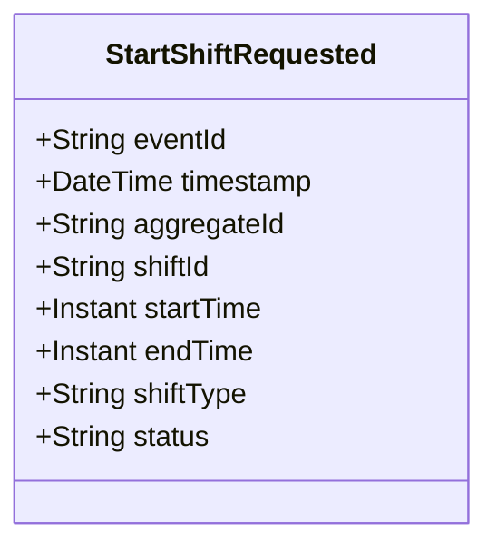

# StartShiftRequested

## Description

This event represents a request to start a shift. It is published to Kafka when a shift start is requested via the REST API. This is a request/command event, not a state change event.

## UML Class Diagram

## Domain Model Effect

This event represents a **request** to create a new `Shift` entity. The actual creation and state management happens in downstream services that consume this event.

- **Request Type**: Start request for a new shift
- **Entity Identifier**: The `shiftId` serves as the unique identifier (also used as `aggregateId`)
- **Requested Attributes**: All provided attributes (startTime, endTime, shiftType, status) are included in the request
- **Status**: The `status` attribute is provided in the request (typically "Started")
- **Timestamps**: The `startTime` and `endTime` are provided as Instants
- **Enum Values**: The `shiftType` and `status` are provided as string enum names
