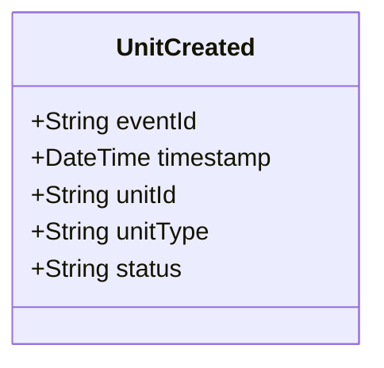

# UnitCreated

## Description

This event is raised when a new unit is created in the system. A unit represents any deployable resource (officer, vehicle, or team).

## UML Class Diagram

## Domain Model Effect

- **Creates**: A new `Unit` entity with the provided attributes
- **Entity Identifier**: The `unitId` serves as the unique identifier
- **Initial Status**: The `status` attribute is set to the provided value
- **Attributes**: All provided attributes (unitId, unitType, status) are set on the new Unit entity
- **lastStatusChange**: The `lastStatusChange` attribute is set to the event timestamp

