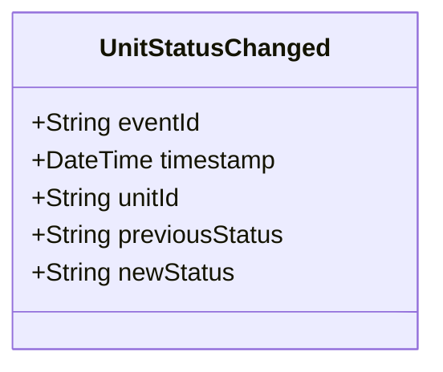

# UnitStatusChanged

## Description

This event is raised when a unit's status changes.

## UML Class Diagram

## Domain Model Effect

- **Modifies**: The existing `Unit` entity identified by `unitId`
- **Status Update**: The `status` attribute of the Unit is updated from `previousStatus` to `newStatus`
- **lastStatusChange**: The `lastStatusChange` attribute is updated to the event timestamp
- **State Transition**: The event documents the state transition for audit purposes

