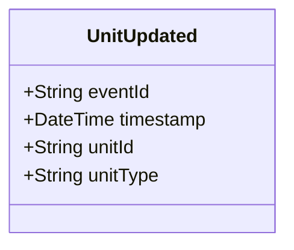

# UnitUpdated

## Description

This event is raised when an existing unit's information is updated (excluding status changes, which use UnitStatusChanged).

## UML Class Diagram

## Domain Model Effect

- **Modifies**: The existing `Unit` entity identified by `unitId`
- **Updated Attributes**: The `unitType` attribute is updated on the Unit entity
- **Note**: The `unitId` cannot be changed as it serves as the entity identifier
- **Note**: Status changes should use the `UnitStatusChanged` event instead

