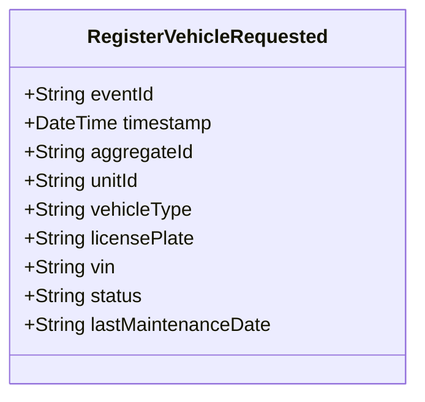

# RegisterVehicleRequested

## Description

This event represents a request to register a new police vehicle. It is published to Kafka when a vehicle registration is requested via the REST API. This is a request/command event, not a state change event.

## UML Class Diagram

## Domain Model Effect

This event represents a **request** to create a new `PoliceVehicle` entity. The actual creation and state management happens in downstream services that consume this event.

- **Request Type**: Registration request for a new police vehicle
- **Entity Identifier**: The `unitId` serves as the unique identifier (also used as `aggregateId`)
- **Requested Attributes**: All provided attributes (vehicleType, licensePlate, vin, status, lastMaintenanceDate) are included in the request
- **Status**: The `status` attribute is provided in the request (typically "Available")
- **Date Format**: The `lastMaintenanceDate` is provided as a string in ISO-8601 format (yyyy-MM-dd) if provided
