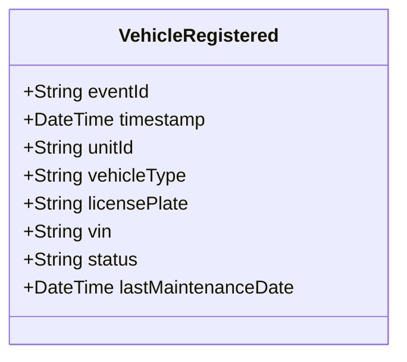

# VehicleRegistered

## Description

This event is raised when a new police vehicle is registered in the system.

## UML Class Diagram

## Domain Model Effect

- **Creates**: A new `PoliceVehicle` entity with the provided attributes
- **Entity Identifier**: The `unitId` serves as the unique identifier
- **Initial Status**: The `status` attribute is set to the provided value (typically "Available")
- **Attributes**: All provided attributes (unitId, vehicleType, licensePlate, vin, status, lastMaintenanceDate) are set on the new PoliceVehicle entity

