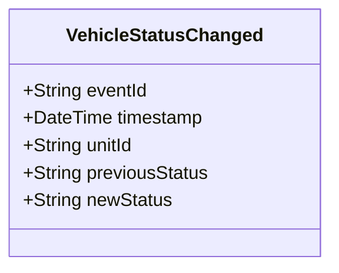

# VehicleStatusChanged

## Description

This event is raised when a police vehicle's status changes (e.g., Available, Assigned, In-Use, Maintenance, Out-of-Service).

## UML Class Diagram

## Domain Model Effect

- **Modifies**: The existing `PoliceVehicle` entity identified by `unitId`
- **Status Update**: The `status` attribute of the PoliceVehicle is updated from `previousStatus` to `newStatus`
- **State Transition**: The event documents the state transition for audit purposes
- **Valid Status Values**: Available, Assigned, In-Use, Maintenance, Out-of-Service

