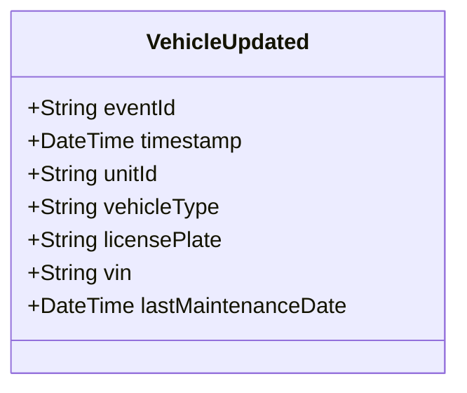

# VehicleUpdated

## Description

This event is raised when an existing police vehicle's information is updated (excluding status changes, which use VehicleStatusChanged).

## UML Class Diagram

## Domain Model Effect

- **Modifies**: The existing `PoliceVehicle` entity identified by `unitId`
- **Updated Attributes**: All provided attributes (vehicleType, licensePlate, vin, lastMaintenanceDate) are updated on the PoliceVehicle entity
- **Note**: The `unitId` cannot be changed as it serves as the entity identifier
- **Note**: Status changes should use the `VehicleStatusChanged` event instead

