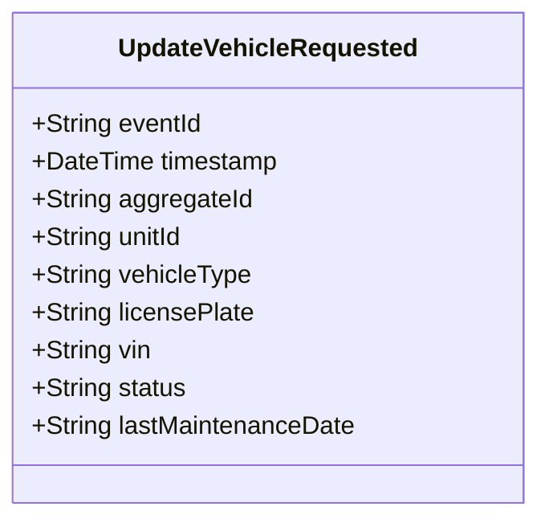

# UpdateVehicleRequested

## Description

This event represents a request to update an existing police vehicle's information. It is published to Kafka when a vehicle update is requested via the REST API. This is a request/command event, not a state change event. All fields are nullable to support partial updates - null fields mean "don't update this field".

## UML Class Diagram

## Domain Model Effect

This event represents a **request** to update an existing `PoliceVehicle` entity. The actual update and state management happens in downstream services that consume this event.

- **Request Type**: Update request for an existing police vehicle
- **Entity Identifier**: The `unitId` identifies the vehicle to update (also used as `aggregateId`)
- **Partial Updates**: All fields are nullable - only non-null fields will be updated
- **Updated Attributes**: Any provided attributes (vehicleType, licensePlate, vin, status, lastMaintenanceDate) are included in the update request
- **Note**: The `unitId` cannot be changed as it serves as the entity identifier
- **Note**: Status changes should use the `ChangeVehicleStatusRequested` event instead
- **Date Format**: The `lastMaintenanceDate` is provided as a string in ISO-8601 format (yyyy-MM-dd) if provided
